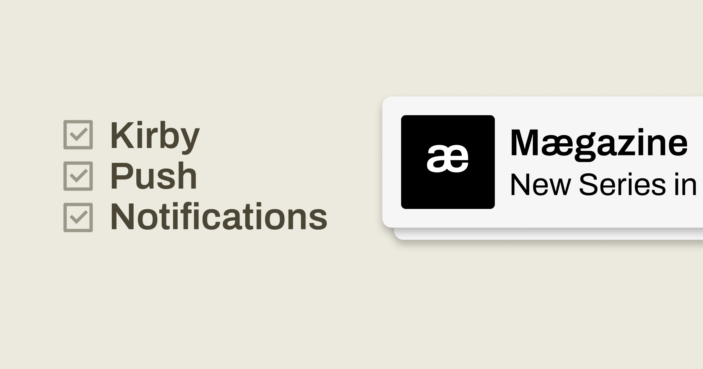
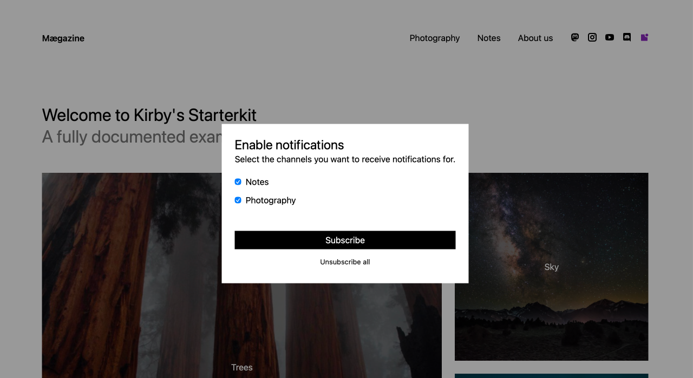
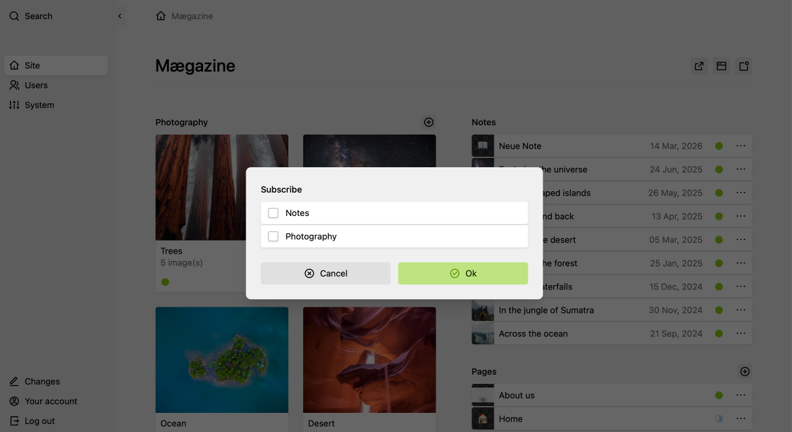
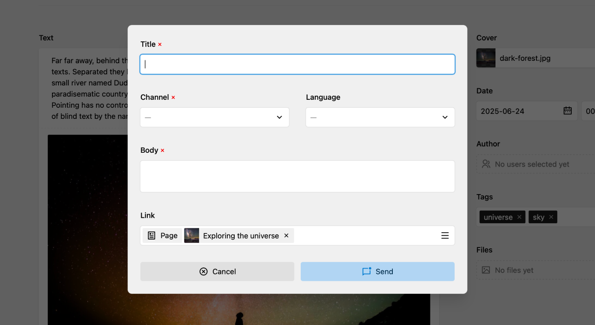

# Kirby Push Notifications


**Kirby Push Notifications** is a plugin for [Kirby CMS](https://getkirby.com/) that adds Web Push support. Visitors can subscribe to channels (e.g. “Notes”, “News”), and you can send notifications from the Panel or via hooks. Subscriptions are stored in SQLite; sending is powered by the [minishlink/web-push](https://github.com/web-push-libs/web-push-php) library with VAPID authentication.



## Features

- 🔔 Visitors subscribe to channels
- 👨‍💻 Editors send notifications from the Panel
- 🚀 Developers automate via hooks

## Requirements

- Kirby 5.x
- PHP 8.2+
- HTTPS (required for Web Push)

## Installation

### Composer (recommended)

In your site root:

```bash
composer require philippoehrlein/kirby-push-notifications
```

### Manual installation

1. Download or clone the repo.
2. Copy the `kirby-push-notifications` folder into `site/plugins/`.

The plugin ships with its own `vendor/`, so no `composer install` in the plugin folder is needed.

## Configuration

In `site/config/config.php` (or a separate config file):

```php
return [
    'philippoehrlein.push-notifications' => [
        'vapid' => [
            'publicKey'  => 'your-vapid-public-key',
            'privateKey' => 'your-vapid-private-key',
            'subject'    => 'https://yourdomain.com',
        ],
        'channels' => [
            [
                'value' => 'notes',
                'text'  => 'Notes',
                'info'  => 'Receive new notes',
            ],
            [
                'value' => 'photos',
                'text'  => 'Photography',
                'info'  => 'Receive the latest Photo series',
            ],
        ],
        // optional: change DB location
        // 'db' => [
        //     'name' => 'push_notifications',
        //     'dir'  => 'site/push-notifications',
        // ],
        // optional: Web Push default options (TTL, contentType, batchSize, etc.)
        // 'webPush' => [
        //     'contentType' => 'application/json',
        //     'TTL' => 3600,
        //     'urgency' => null,
        //     'topic' => null,
        //     'batchSize' => 1000,
        //     'requestConcurrency' => 100,
        // ],
    ],
];
```

### VAPID keys

Web Push requires a VAPID key pair. Set `vapid.publicKey`, `vapid.privateKey` and `vapid.subject` (your site URL, e.g. `https://yourdomain.com`). Keep the private key secret.

**Generating keys:** Use the [Create VAPID keys](https://github.com/web-push-libs/web-push-php?tab=readme-ov-file#create-vapid-keys) section in the web-push-php README (OpenSSL in bash or `VAPID::createVapidKeys()` in PHP).

### Option webPush

Optional: Set global defaults for all push sends with the `webPush` option. Keys: `contentType` (e.g. `application/json`), `TTL` (seconds, e.g. 3600), `urgency`, `topic`, `batchSize`, `requestConcurrency`. Usually `urgency` and `topic` are left `null` here and set per send via the hook payload (see [Payload for send hooks](#payload-for-send-hooks)). You can still set global defaults if needed.

## Usage

There are two main use cases: **website** (visitors subscribe) and **panel** (editors manage or send notifications). Each can be used in a simple way (ready-made UI) or a custom way (your own UI with the same APIs).

---

### Website

#### Simple: Dialog snippet



Use the `kpn-dialog` snippet for a button that opens a subscribe/unsubscribe dialog with channel checkboxes. No custom JS needed.

In a template or snippet:

```php
<?php snippet('kpn-dialog', slots: true) ?>
🔔 Notifications
<?php endsnippet() ?>
```

Optional: pass data to override defaults or translations:

```php
<?php snippet('kpn-dialog', [
    'headline'    => 'Your Headline',
    'description' => 'Choose the channels you want to receive.',
    // 'channels'   => [['value' => 'news', 'text' => 'News', 'info' => '…']],
], slots: true) ?>
🔔 Notifications
<?php endsnippet() ?>
```

#### Custom: helper.js

If you don’t want the dialog (e.g. a single button with fixed channels, or your own UI), use the helper script. Set `window.KPN_CONFIG` (vapidPublicKey, subscribeUrl, unsubscribeUrl, swPath), load `/assets/kpn/helper.js`, then call `window.KPN.subscribe(channels)` and `window.KPN.unsubscribe()`. You stay in control of markup and flow; the helper only handles the Web Push API and the plugin routes.

---

### Panel

#### Simple: View buttons, button components, dialog



The plugin ships with two **view buttons** (`kpn-subscribe`, `kpn-notification`), two **button components** (`kpn-subscribe-button`, `kpn-notification-button`) and one **dialog** (`kpn-subscribe-dialog`). Register and place them in your Panel blueprints or views where needed. That’s enough to let logged-in users subscribe/unsubscribe and to send a notification (channel, title, body) without building your own UI. See `src/index.js` and `src/components/` for how they’re wired.



#### Custom: Your own UI with hooks and API

Build your own Panel UI and call the **hooks** (subscribe, unsubscribe, send-to-one, send-to-many) and the **Panel API** (e.g. get-channels, get-keys, status, subscribe, unsubscribe). Same backend, full control over the interface.

Example: send a push when a note is published:

```php
// site/config/config.php
'hooks' => [
    'page.changeStatus:after' => function ($newPage, $oldPage) {
        if ($newPage->intendedTemplate() === 'note' && $newPage->status() === 'listed') {
            kirby()->trigger('philippoehrlein.push-notifications.send-to-many', [
                'payload' => [
                    'message' => [
                        'title' => kirby()->site()->title()->value(),
                        'body'  => 'New note: ' . $newPage->title()->value(),
                        'data'  => ['url' => $newPage->url()],
                    ],
                    'channel' => 'notes',
                    'options' => ['urgency' => 'normal'],
                ],
            ]);
        }
    },
],
```

---

## Hooks

| Hook | Use case |
|------|----------|
| `philippoehrlein.push-notifications.subscribe` | After a subscription is created (payload: endpoint, keys, channel, user_id). |
| `philippoehrlein.push-notifications.unsubscribe` | After unsubscription (payload: endpoint and/or user_id, channel). |
| `philippoehrlein.push-notifications.send-to-one` | Send to one user (payload: user_id, message, channel?, options?). |
| `philippoehrlein.push-notifications.send-to-many` | Send to many users or to a full channel (payload: message, user_ids?, channel?, options?). |

### Payload for send hooks

For **send-to-one** and **send-to-many**, the payload can include an optional **`options`** array with Web Push options for that send:

- **`urgency`**: Delivery priority – `'very-low'`, `'low'`, `'normal'`, `'high'`. Affects delivery timing and presentation (e.g. sound, vibration).
- **`topic`**: Optional. When set, push services may replace older notifications with the same topic by newer ones (collapse). Whether and when to use e.g. the channel as topic is up to you (e.g. `'topic' => $channel` for one notification per channel).
- **`TTL`**: Optional, time-to-live in seconds for this message.

Example: `'options' => ['urgency' => 'high', 'TTL' => 600]`.

## Routes and API

- **Frontend (public):**
  - `POST /push-notifications/subscribe` — Body: `endpoint`, `keys`, `channel`. Param: `lang` (optional).
  - `POST /push-notifications/unsubscribe`
  - `GET /push-notifications-sw.js` (service worker)
  - `GET /assets/kpn/helper.js`
- **Panel API:** `philippoehrlein/push-notifications/*` (subscribe, unsubscribe, get-channels, get-keys, status, etc.).

## License

MIT. See [LICENSE](LICENSE) for details.

## Support

- Issues: [GitHub Issues](https://github.com/philippoehrlein/kirby-push-notifications/issues)
- Contact: github@philippoehrlein.de
