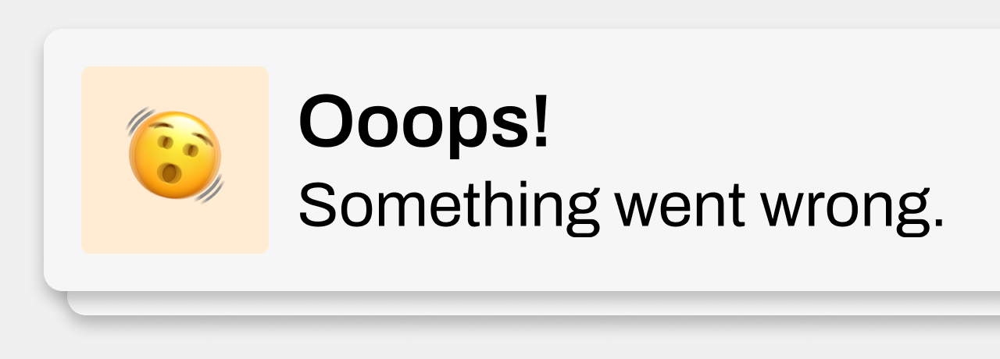

# Exception Notifications



This example shows how to send Push Notifications when a Kirby exception occurs (e.g. a PHP error in a template) and how to **throttle** those notifications with a custom Kirby cache to avoid spamming.

It is meant as **project-specific example code**, not as part of the core plugin API. Adjust naming, cooldown times and channels to your needs.

## How it works

1. Kirby throws an exception during a request (for example in a template or snippet).
2. The global `system.exception` hook is called.
3. The hook builds a cache key from the exception message and the current URL.
4. A custom cache (`kpn-exceptions`) stores the last send timestamp per key.
5. If the last send is within the cooldown window, no new notification is sent.


### 1. Define a custom cache for exceptions

Add a dedicated cache instance to the same config file. This keeps the exception throttle separate from your page cache or other caches:

```php
<?php
# site/config/config.php

return [
    // …
    'cache' => [
        // enables a file cache at `site/cache/kpn-exceptions`
        'kpn-exceptions' => true,
    ],
    // …
];
```

You can customize the cache driver and prefix like any other Kirby cache.

### 2. Add the `system.exception` hook with throttling

Now wire everything together in `site/config/config.php`:

```php
<?php
# site/config/config.php

use Kirby\Toolkit\Str;

return [
    // …
    'hooks' => [
        'system.exception' => function (Throwable $exception) {
            // No push notifications while you are working on it
            if (option('debug')) {
                return;
            }

            $kirby = kirby();
            $cache = $kirby->cache('kpn-exceptions');

            // Build a key that groups similar exceptions together
            $url     = $kirby->request()->url()->toString();
            $key     = md5($exception->getMessage() . '|' . $url);
            $now     = time();
            $cooldown = 1200; // 20 minutes

            $lastSent = $cache->get($key);

            if ($lastSent && ($now - $lastSent) < $cooldown) {
                // Within cooldown window: skip sending a new push
                return;
            }

            // Store current timestamp with TTL (in minutes)
            $cache->set($key, $now, $cooldown / 60);

            $body = Str::short($exception->getMessage(), 120);

            $payload = [
                'message' => [
                    'title' => '🙀 Ooops! Kirby Exception',
                    'body'  => $body,
                    'data'  => [
                        'url' => $url,
                    ],
                ],
                'channel' => 'dev-alerts',
                'options' => [
                    'urgency' => 'high',
                    'topic'   => 'dev-errors',
                ],
            ];

            kirby()->trigger(
                'philippoehrlein.push-notifications.send-to-many',
                ['payload' => $payload]
            );
        },
    ],
];
```

## Notes

- The cooldown logic is based on both the **exception message** and the **current URL**. If you want to group errors more broadly, you can change the key to use only the message or even a custom error code.
