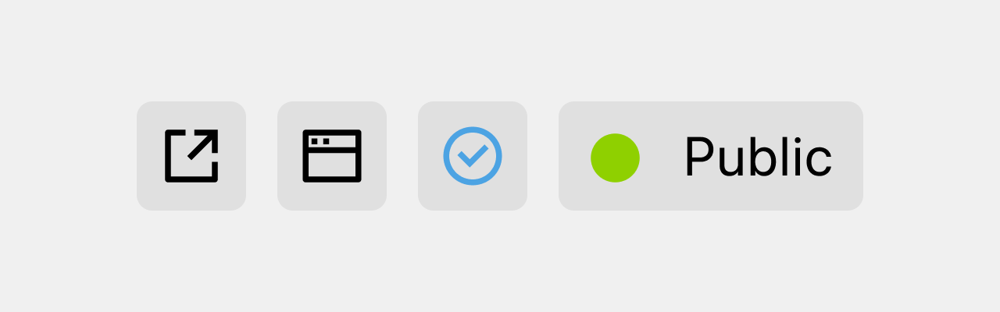
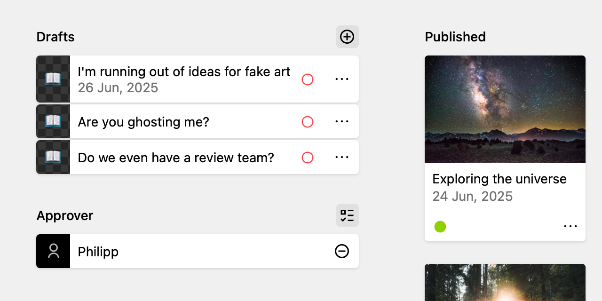

# Note Approval Workflow



This example shows how to build an editorial approval workflow using Kirby's built-in page statuses and Push Notifications. It is based on the [Kirby Starterkit](https://github.com/getkirby/starterkit).

## How it works

1. An editor sets a note to **In Review** (`unlisted`)
2. Assigned approvers receive a Push Notification with a direct link to the Panel
3. The approver reviews and publishes the note (`listed`)

## Setup

### 1. Add an approver field to the notes blueprint

In `site/blueprints/pages/notes.yml`, add a settings section with a `users` field.



```yaml
# site/blueprints/pages/notes.yaml
# I placed it in the first column between the drafts and the unlisted sections

sections:
  settings:
    type: fields
    fields:
      approver:
        type: users
        label: Approver
        max: 3

```

### 2. Add a Panel view button for approvers

The button will be only visible to users who are assigned as approvers on the current notes page. It lets them subscribe to the `note-approval` channel directly from the Panel.

The `kpn-subscribe-button` accepts the same UI props as Kirby's native `k-button`: `icon`, `theme`, `title`, `text`, `variant`, `size` and `disabled`, so it fits naturally into any Panel UI.


> **Note:** The `note-approval` channel is defined directly on the button and never appears in the public subscribe UI. This way you can create internal channels that are only accessible to specific users in specific contexts.

```php
# site/config/config.php

return [
    'panel' => [
        'viewButtons' => [
            'page' => [
                'subscribe-notes-approve' => function ($kirby, $site, $user, $page) {
                    if (!$user || !$page) return null;
                    if ($page->intendedTemplate()->name() !== 'notes') return null;

                    $approverIds = $page->approver()->toUsers()->pluck('id');
                    if (!in_array($user->id(), $approverIds, true)) return null;

                    return [
                        'component' => 'kpn-subscribe-button',
                        'props' => [
                            'icon'     => 'check',
                            'theme'    => 'blue-icon',
                            'title'    => 'Subscribe to Note Approval',
                            'channels' => [
                                [
                                    'value' => 'note-approval',
                                    'text'  => 'Note Approval',
                                    'info'  => 'Get notified when a note is waiting for approval',
                                ],
                            ],
                        ],
                    ];
                },
            ],
        ],
    ],
]
```

### 3. Add a hook to trigger notifications

When a note is set to `unlisted`, this hook sends a Push Notification to all assigned approvers. If no approvers are defined, it falls back to all subscribers of the `note-approval` channel.

The notification links directly to the Panel page so the approver can review and publish with one click.

```php
# site/config/config.php

return [
    'hooks' => [
        'page.changeStatus:after' => function (Kirby\Cms\Page $newPage, Kirby\Cms\Page $oldPage) {
            if ($newPage->intendedTemplate()->name() !== 'note') return;
            if ($newPage->status() !== 'unlisted') return;

            $notes = site()->find('notes');
            $approvers = $notes->approver()->toUsers();
            $userIds = $approvers->pluck('id');

            $payload = [
                'message' => [
                    'title' => 'Note waiting for approval',
                    'body'  => 'Ready for review: ' . $newPage->title(),
                    'data'  => ['url' => $newPage->panel()->url()],
                ],
                'channel' => 'note-approval',
            ];

            if (count($userIds) > 0) {
                $payload['user_ids'] = $userIds;
            }

            kirby()->trigger('philippoehrlein.push-notifications.send-to-many', ['payload' => $payload]);
        },
    ],
]
```

## Notes

- The approver field is placed on the parent `notes` page, not on individual notes. This way you define your approval team once for all notes.
- If no approvers are assigned, all subscribers of the `note-approval` channel will be notified as a fallback.
- The notification URL points to the Panel (`$newPage->panel()->url()`) so approvers land directly in the right place.

