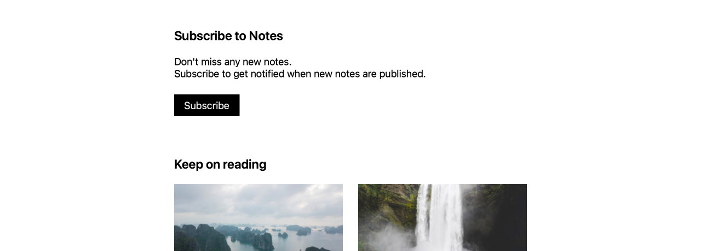

# Simple subscribe button



This example shows how to add a **single subscribe button** to the Kirby Starterkit so visitors can subscribe to new notes with one click. It uses the Kirby Push Notifications helper script and a small custom snippet.

## How it works

1. A visitor clicks the _Subscribe to Notes_ button on a note.
2. The browser asks for notification permission (once).
3. The helper script registers a push subscription and sends it to the plugin backend for the `notes` channel.
4. The button is briefly disabled and shows a visual confirmation (`🔔 Subscribed!`).

## Setup

This example assumes you start from the [Kirby Starterkit](https://github.com/getkirby/starterkit).

### 1. Configure the `notes` channel

In `site/config/config.php`, configure a public `notes` channel for website subscribers:

```php
<?php

return [
    'philippoehrlein.push-notifications' => [
        'vapid' => [
            'publicKey'  => 'your-vapid-public-key',
            'privateKey' => 'your-vapid-private-key',
            'subject'    => 'https://yourdomain.com',
        ],
        'channels' => [
            'website' => [
                [
                    'value' => 'notes',
                    'text'  => 'Notes',
                    'info'  => 'Receive new notes',
                ],
            ],
        ],
    ],
];
```

### 2. Add a `subscribe` snippet

Create `site/snippets/subscribe.php` with a small subscribe UI and wiring to the plugin:

```php
<!-- Config snippet from Kirby Push Notifications plugin -->
<?= snippet('kpn-config') ?>

<style>
.subscribe {
  margin-bottom: 4rem;

  p {
    line-height: 1.2;
    margin-bottom: 1.5rem;
  }
}

.subscribe-button {
  padding: .5rem 1rem;
  border: none;
  background: var(--color-black);
  color: var(--color-light);
  cursor: pointer;

  &:hover {
    background: var(--color-light);
    color: var(--color-black);
  }
}

.subscribe-button:disabled {
  opacity: .6;
  cursor: default;
}

.subscribe-button.is-subscribed {
  background: var(--color-light);
  color: var(--color-black);
}
</style>

<!-- Helper.js from Kirby Push Notifications plugin -->
<script src="/assets/kpn/helper.js"></script>

<div class="subscribe">
  <h2 class="h2">Subscribe to Notes</h2>
  <p>Don't miss any new notes.<br>Subscribe to get notified when new notes are published.</p>
  <button class="subscribe-button" id="subscribe-button">Subscribe</button>
</div>

<script>
  const btn = document.getElementById('subscribe-button');
  const originalText = btn.textContent;

  btn.addEventListener('click', async function () {
    btn.disabled = true;

    try {
      // Subscribe the current browser to the "notes" channel
      await window.KPN.subscribe(['notes']);

      // Simple success feedback
      btn.textContent = '🔔 Subscribed!';
      btn.classList.add('is-subscribed');

      // Reset button after 1.5 seconds
      setTimeout(() => {
        btn.textContent = originalText;
        btn.disabled = false;
        btn.classList.remove('is-subscribed');
      }, 1500);
    } catch (err) {
      console.error('Subscription failed', err);
      alert(err.message || 'Subscription failed');
      btn.disabled = false;
    }
  });
</script>
```

### 3. Include the snippet in the notes template

In the Starterkit, open `site/templates/note.php` and include the snippet at a suitable position, for example below the note content:

```php
<?php snippet('header') ?>

<main class="main">
  <!-- your existing note template code -->

  <?php snippet('subscribe') ?>
</main>

<?php snippet('footer') ?>
```

Now every note shows a simple subscribe button that registers the visitor for the `notes` channel using the Kirby Push Notifications plugin. You can later send pushes for new notes via Panel UI or hooks.
